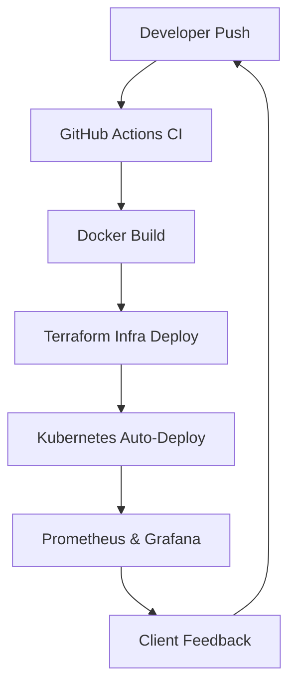

<!-- Profile Header -->

  

<h1 align="center">Hi, I'm Rajeev 👨‍💻</h1>

  <b>Full-Stack Developer | DevOps Architect | Cloud Specialist | E-commerce Expert</b> 
  🚀 10+ years of experience building scalable systems and leading tech across SaaS, DevOps, and E-Commerce.

---

## 🧑‍💼 About Me

- 🔧 I build end-to-end platforms — from design to deployment.
- 🛒 Shopify & WordPress expert (custom themes, headless setups, plugins)
- ⚙️ DevOps-certified professional: CI/CD, Docker, Kubernetes, AWS, Terraform.
- 🖥️ Designed eCommerce & CMS platforms visited by 50k+ monthly users.

💡 _I'm a believer in clean architecture, DX-first development, and lifelong learning._

---

## 🚀 Featured Portfolio Projects

| Project         | Description                                                                     | Live Demo                            |
| --------------- | ------------------------------------------------------------------------------- | ------------------------------------ |
| 🛍️ ZetupStore   | E‑commerce platform built with Shopify & React. Scalable and modern marketplace | [🔗 Visit](https://zetupstore.com)   |
| 📝 GearUpPHP    | Personal blog on PHP, Laravel, Node & system architecture                       | [🔗 Visit](https://gearupphp.com)    |
| 💼 PSA Advisors | Corporate WordPress site with Elementor & SEO optimization                      | [🔗 Visit](https://psanadvisors.com) |

---

## 🧠 Skills & Specialties

### ⚙️ DevOps & Cloud

### 💻 Languages & Frameworks

### 🛒 CMS & Design

---

## 📈 GitHub Stats

  
  
  

---

## 🏆 Trophies, Contributions & Open Source

  
   
  
   
  

---

## 📊 DevOps Architecture (Visual)

---

## 🤝 Let's Connect

  
  
  
  

---

> ⚡ _“Building robust code, scaling ideas, and automating the future.”_
