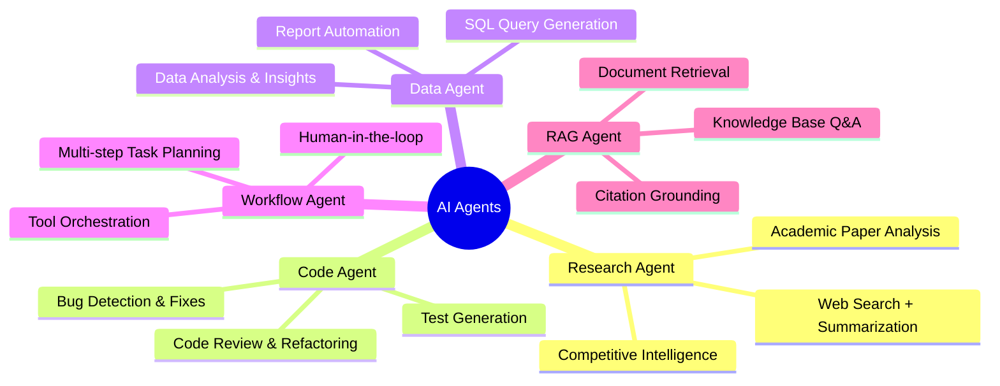
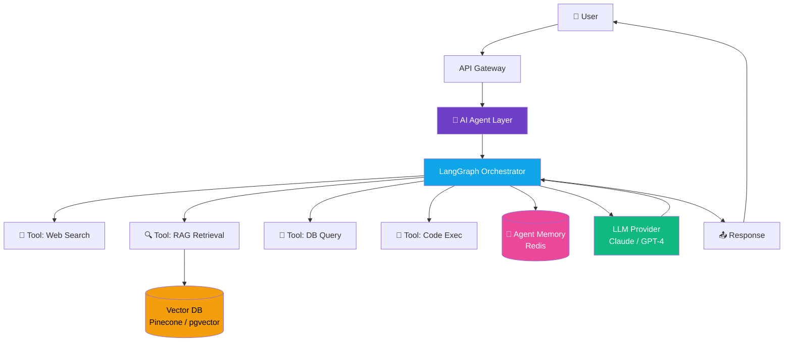

<!-- ══════════════════════════════════════════════════════════
     HERO BANNER — replace header.png with your custom banner
     Generate one at: https://www.canva.com or https://www.bannerbear.com
     ══════════════════════════════════════════════════════════ -->
<p align="center">
  
</p>

<!-- ── ANIMATED TYPING BANNER ── -->
<p align="center">
  <a href="https://git.io/typing-svg">
    
  </a>
</p>

<!-- ── SOCIAL + VISITOR BADGES ── -->
<p align="center">
  <a href="https://www.linkedin.com/in/achrarajeev">
    
  </a>
  <a href="https://twitter.com/achrarajeev">
    
  </a>
  <a href="https://gearupphp.com">
    
  </a>
  <a href="mailto:achrarajeev@gmail.com">
    
  </a>
  <a href="https://achrarajeev.dev">
    
  </a>
</p>

<p align="center">
  
  
</p>

---

<!-- ══════════════════════════════════════════════════════════
     ABOUT ME
     ══════════════════════════════════════════════════════════ -->

## 🧠 About Me

```python
class RajeevAchra:

    role        = "AI Engineer & Full-Stack Developer"
    location    = "India 🇮🇳"
    experience  = "10+ years building scalable products"

    currently_building = [
        "LLM-powered agentic workflows",
        "RAG systems with vector databases",
        "Multi-agent orchestration pipelines",
        "MCP (Model Context Protocol) integrations",
    ]

    currently_learning = [
        "Advanced fine-tuning (LoRA / QLoRA)",
        "AI Infrastructure & MLOps",
        "Reasoning models & chain-of-thought prompting",
        "Claude Agent SDK & Anthropic ecosystem",
    ]

    interests = [
        "Generative AI", "LLM Agents", "RAG", "Prompt Engineering",
        "AI Automation", "Open Source", "Technical Writing",
    ]

    career_goal = "Build AI systems that solve real-world problems at scale"
    fun_fact    = "I debug AI hallucinations the same way I debug legacy PHP 🙃"
```

---

<!-- ══════════════════════════════════════════════════════════
     AI ENGINEERING FOCUS
     ══════════════════════════════════════════════════════════ -->

## 🤖 AI Engineering Expertise

<table align="center">
<tr>
<td align="center" width="160">
  <br/>
  <sub>GPT-4 · Claude · Gemini · Llama</sub>
</td>
<td align="center" width="160">
  <br/>
  <sub>Retrieval-Augmented Generation</sub>
</td>
<td align="center" width="160">
  <br/>
  <sub>ReAct · Tool Use · Memory</sub>
</td>
<td align="center" width="160">
  <br/>
  <sub>CoT · Few-Shot · Structured Output</sub>
</td>
</tr>
<tr>
<td align="center" width="160">
  <br/>
  <sub>LangGraph · CrewAI · AutoGen</sub>
</td>
<td align="center" width="160">
  <br/>
  <sub>Model Context Protocol</sub>
</td>
<td align="center" width="160">
  <br/>
  <sub>LoRA · QLoRA · PEFT</sub>
</td>
<td align="center" width="160">
  <br/>
  <sub>Pipelines · Workflows · APIs</sub>
</td>
</tr>
</table>

---

<!-- ══════════════════════════════════════════════════════════
     TECH STACK
     ══════════════════════════════════════════════════════════ -->

## 🛠️ Tech Stack

### 🤖 AI / ML


### 🗄️ Vector Databases & Data


### 🌐 Web & APIs


### ☁️ Cloud & DevOps


---

<!-- ══════════════════════════════════════════════════════════
     FEATURED AI PROJECTS
     ══════════════════════════════════════════════════════════ -->

## 🚀 Featured AI Projects

<table>
<tr>
<td width="50%">

### 🤖 AI Agent Framework


Multi-agent orchestration system with tool use, memory, and autonomous decision-making. Built with LangGraph + Claude API.

**Stack:** `Python` `LangGraph` `Claude` `FastAPI` `Redis`

</td>
<td width="50%">

### 🔍 RAG Knowledge Engine


Production RAG pipeline with hybrid search (semantic + keyword), reranking, and citation grounding over 100k+ documents.

**Stack:** `Python` `LangChain` `Pinecone` `OpenAI` `FastAPI`

</td>
</tr>
<tr>
<td width="50%">

### 🧠 LLM Evaluation Suite


Automated evaluation harness for LLM outputs — measures accuracy, hallucination rate, coherence, and latency across models.

**Stack:** `Python` `DeepEval` `Promptfoo` `Next.js`

</td>
<td width="50%">

### ⚡ MCP Server Collection


Custom MCP servers for Claude Code — GitHub, Notion, Jira, and internal tools integration via Model Context Protocol.

**Stack:** `TypeScript` `Claude SDK` `MCP` `Node.js`

</td>
</tr>
<tr>
<td width="50%">

### 🛍️ ZetupStore — AI-Enhanced E-Commerce
[](https://zetupstore.com)

Headless Shopify platform with AI-powered product recommendations and conversational shopping assistant.

**Stack:** `React` `Next.js` `Shopify` `OpenAI` `Node.js`

</td>
<td width="50%">

### 📝 GearUpPHP — Developer Blog
[](https://gearupphp.com)

Technical blog covering AI engineering, system design, PHP, Laravel, and developer tooling. 50k+ monthly readers.

**Stack:** `WordPress` `PHP` `SEO` `AWS`

</td>
</tr>
</table>

---

<!-- ══════════════════════════════════════════════════════════
     AI PROJECTS PORTFOLIO (Deep Dive)
     ══════════════════════════════════════════════════════════ -->

## 🧠 AI Projects Portfolio

| # | Project | Type | Stack | Status |
|---|---------|------|-------|--------|
| 1 | 🤖 Multi-Agent Orchestration System | Agentic AI | LangGraph · Claude · Python | 🟢 Live |
| 2 | 🔍 Hybrid RAG Pipeline | RAG | LangChain · Pinecone · GPT-4 | 🟢 Live |
| 3 | 📊 LLM Eval & Benchmark Tool | Evaluation | DeepEval · Python · Streamlit | 🟡 WIP |
| 4 | 🔧 MCP Servers Collection | MCP | Claude SDK · TypeScript · MCP | 🔵 Open Source |
| 5 | 🎯 AI Code Review Agent | Agents | Claude · GitHub API · FastAPI | 🟡 WIP |
| 6 | 🧬 Fine-Tuned Domain LLM | Fine-Tuning | LoRA · HuggingFace · PyTorch | 🟡 WIP |
| 7 | 🌐 AI-Powered API Gateway | Infrastructure | Python · FastAPI · Redis | 🟢 Live |
| 8 | 💬 Document Chat (RAG) | RAG | LangChain · ChromaDB · Next.js | 🔵 Open Source |

---

<!-- ══════════════════════════════════════════════════════════
     AI AGENTS BUILT
     ══════════════════════════════════════════════════════════ -->

## 🤖 AI Agents Built


```mermaid
mindmap
  root((AI Agents))
    Research Agent
      Web Search + Summarization
      Academic Paper Analysis
      Competitive Intelligence
    Code Agent
      Code Review & Refactoring
      Bug Detection & Fixes
      Test Generation
    Data Agent
      SQL Query Generation
      Data Analysis & Insights
      Report Automation
    Workflow Agent
      Multi-step Task Planning
      Tool Orchestration
      Human-in-the-loop
    RAG Agent
      Knowledge Base Q&A
      Document Retrieval
      Citation Grounding
```

---

<!-- ══════════════════════════════════════════════════════════
     2026 AI ENGINEER ROADMAP
     ══════════════════════════════════════════════════════════ -->

## 🗺️ 2026 AI Engineer Roadmap

<div align="center">

| # | Domain | Progress | Status | Key Stack |
|:---:|--------|:--------:|:------:|-----------|
| 🟣 **01** | **LLM Engineering** | `████████░░` 80% | ✅ Active | GPT-4 · Claude · Structured Outputs · Tool Use |
| 🔵 **02** | **Agentic AI** | `███████░░░` 70% | ✅ Active | LangGraph · CrewAI · AutoGen · ReAct |
| 🟢 **03** | **RAG & Retrieval** | `████████░░` 80% | ✅ Active | Pinecone · pgvector · BM25 · Reranking |
| 🟡 **04** | **MCP & Tool Use** | `██████░░░░` 60% | 🔧 Building | Claude SDK · MCP Protocol · Custom Servers |
| 🩷 **05** | **AI Infrastructure** | `█████░░░░░` 50% | 🔧 Building | LLMOps · Model Serving · Vector DB Ops |
| 🔴 **06** | **Fine-Tuning** | `████░░░░░░` 40% | 📚 Learning | LoRA · QLoRA · PEFT · HuggingFace |
| 💙 **07** | **Cloud AI Deploy** | `█████░░░░░` 50% | 🔧 Building | AWS Bedrock · SageMaker · GCP Vertex |

</div>

---

<!-- ══════════════════════════════════════════════════════════
     2026 LEARNING GOALS
     ══════════════════════════════════════════════════════════ -->

## 🎯 2026 Learning Goals

- [x] Master LangGraph for stateful agentic workflows
- [x] Build production-grade RAG pipelines with hybrid retrieval
- [x] Implement MCP servers for Claude Code integrations
- [ ] Complete a fine-tuning project with LoRA on custom domain data
- [ ] Deploy a full LLMOps pipeline with evaluation, monitoring & versioning
- [ ] Contribute to a major open-source AI framework (LangChain / LangGraph)
- [ ] Publish 12 technical articles on AI engineering in 2026
- [ ] Speak at an AI/tech conference or meetup
- [ ] Build and launch an AI SaaS product
- [ ] Achieve AWS Certified Machine Learning Specialty

---

<!-- ══════════════════════════════════════════════════════════
     GITHUB STATS
     ══════════════════════════════════════════════════════════ -->

## 📊 GitHub Stats

<p align="center">
  
  
</p>

<p align="center">
  
</p>

<p align="center">
  
</p>

<p align="center">
  
</p>

<!-- ── MILESTONES ── -->
<p align="center">
  
  
  
  
  
  
</p>

<!-- ── CONTRIBUTION SNAKE ── -->
<p align="center">
  <picture>
    <source media="(prefers-color-scheme: dark)"
            srcset="https://raw.githubusercontent.com/achrarajeev/achrarajeev/main/output/github-snake-dark.svg">
    <source media="(prefers-color-scheme: light)"
            srcset="https://raw.githubusercontent.com/achrarajeev/achrarajeev/main/output/github-snake.svg">
    
  </picture>
</p>

---

<!-- ══════════════════════════════════════════════════════════
     AI EXPERIMENT TRACKER
     ══════════════════════════════════════════════════════════ -->

## 📈 AI Experiment Tracker

| Experiment | Model | Metric | Result | Notes |
|-----------|-------|--------|--------|-------|
| RAG Chunk Size Tuning | GPT-4o | F1 Score | `0.87 → 0.93` | 512 tokens optimal |
| Hybrid Search vs Dense | Claude 3.5 | Recall@10 | `0.81 → 0.91` | BM25 + embedding wins |
| ReAct vs Plan-and-Execute | GPT-4o | Task Success | `68% → 79%` | P&E better for complex tasks |
| CoT Prompt vs Direct | Claude Sonnet | Accuracy | `72% → 89%` | CoT significantly better |

---

<!-- ══════════════════════════════════════════════════════════
     TECHNICAL WRITING
     ══════════════════════════════════════════════════════════ -->

## ✍️ Technical Writing

| Article | Platform | Topic |
|---------|----------|-------|
| [Building Production RAG Systems in 2026](https://gearupphp.com) | GearUpPHP | RAG · LangChain |
| [LangGraph vs CrewAI: Agent Frameworks Compared](https://gearupphp.com) | GearUpPHP | Agentic AI |
| [MCP Servers: Supercharge Claude with Custom Tools](https://gearupphp.com) | GearUpPHP | MCP · Claude |
| [Prompt Engineering Patterns that Actually Work](https://gearupphp.com) | GearUpPHP | Prompt Engineering |
| [RAG vs Fine-Tuning: When to Use What](https://gearupphp.com) | GearUpPHP | LLMs |

> 📌 All articles available at **[gearupphp.com](https://gearupphp.com)**

---

<!-- ══════════════════════════════════════════════════════════
     RESEARCH PAPERS READING LIST
     ══════════════════════════════════════════════════════════ -->

## 📚 Research Papers I've Read & Applied

| Paper | Year | Concept Applied |
|-------|------|-----------------|
| Attention Is All You Need | 2017 | Transformer architecture fundamentals |
| RAG: Retrieval-Augmented Generation | 2020 | Built hybrid RAG pipelines |
| ReAct: Synergizing Reasoning & Acting | 2022 | Agent reasoning loops |
| HyDE: Hypothetical Document Embeddings | 2022 | Improved RAG retrieval |
| Self-RAG: Learning to Retrieve on Demand | 2023 | Adaptive retrieval agents |
| LLM-as-a-Judge | 2023 | LLM evaluation harness |
| Constitutional AI | 2022 | Safe agent behavior patterns |

---

<!-- ══════════════════════════════════════════════════════════
     OPEN SOURCE CONTRIBUTIONS
     ══════════════════════════════════════════════════════════ -->

## 🌍 Open Source Contributions

<p align="center">
  
</p>

| Repository | Type | Contribution |
|-----------|------|-------------|
| `langchain-ai/langchain` | Bug Fix | Fixed streaming callback handler |
| `openai/openai-python` | Docs | Improved async streaming examples |
| `langchain-ai/langgraph` | Feature | Added custom memory node pattern |

---

<!-- ══════════════════════════════════════════════════════════
     HACKATHONS & COMPETITIONS
     ══════════════════════════════════════════════════════════ -->

## 🏆 Hackathons & Competitions

| Event | Year | Achievement |
|-------|------|-------------|
| Anthropic AI Hackathon | 2025 | 🤝 Participant |
| AI Engineer World's Fair | 2025 | 🎤 Attended & Networked |
| GearUpPHP Blog Launch | 2023 | 🏆 50k+ Monthly Readers |

---

<!-- ══════════════════════════════════════════════════════════
     CERTIFICATIONS
     ══════════════════════════════════════════════════════════ -->

## 🎓 Certifications

<p align="center">
  
  <!--  -->
  <!--  -->
  <!--  -->
  
  
</p>

---

<!-- ══════════════════════════════════════════════════════════
     TALKS & PRESENTATIONS
     ══════════════════════════════════════════════════════════ -->

## 🎤 Talks & Presentations

| Talk | Event | Year |
|------|-------|------|
| "Building AI Agents with LangGraph" | Local AI Meetup | 2025 |
| "RAG in Production — Lessons Learned" | Tech Talk | 2026 |

---

<!-- ══════════════════════════════════════════════════════════
     CURRENT STARTUP IDEAS (Optional — remove if not relevant)
     ══════════════════════════════════════════════════════════ -->

## 🚀 Current Startup Ideas / Experiments

> _Building in public. These are early-stage ideas I'm exploring._

- 🧠 **AI Knowledge Assistant** — RAG-powered team knowledge base with Slack integration
- 🤖 **Autonomous Code Review Agent** — AI agent that reviews PRs, suggests improvements, detects bugs
- 📊 **LLM Analytics Dashboard** — Track prompt performance, costs, latency across providers

---

<!-- ══════════════════════════════════════════════════════════
     WEEKLY DEVELOPMENT LOG
     ══════════════════════════════════════════════════════════ -->

## 🔥 Weekly Dev Log

> **Week of June 2026:**
> - 🔧 Built a custom MCP server for Notion + Claude integration
> - 📖 Read: "Self-RAG: Learning to Retrieve, Generate, and Critique through Self-Reflection"
> - 🧪 Experimented with LangGraph's interrupt-and-resume for human-in-the-loop agents
> - ✍️ Published: "MCP Servers: Supercharge Claude with Custom Tools"

---

<!-- ══════════════════════════════════════════════════════════
     DEVOPS ARCHITECTURE (Legacy — demonstrates full-stack depth)
     ══════════════════════════════════════════════════════════ -->

## ⚙️ System Design: AI Application Architecture


```mermaid
flowchart TD
  U[👤 User] --> G[API Gateway]
  G --> A[🤖 AI Agent Layer]
  A --> L[LangGraph Orchestrator]
  L --> T1[🔧 Tool: Web Search]
  L --> T2[🔍 Tool: RAG Retrieval]
  L --> T3[💾 Tool: DB Query]
  L --> T4[📝 Tool: Code Exec]
  T2 --> V[(Vector DB\nPinecone / pgvector)]
  L --> M[(💾 Agent Memory\nRedis)]
  L --> LLM[LLM Provider\nClaude / GPT-4]
  LLM --> L
  L --> R[📤 Response]
  R --> U

  style A fill:#6E40C9,color:#fff
  style L fill:#0EA5E9,color:#fff
  style LLM fill:#10B981,color:#fff
  style V fill:#F59E0B,color:#000
  style M fill:#EC4899,color:#fff
```

---

<!-- ══════════════════════════════════════════════════════════
     CONNECT
     ══════════════════════════════════════════════════════════ -->

## 🤝 Let's Connect & Collaborate

<p align="center">
  <a href="https://www.linkedin.com/in/achrarajeev">
    
  </a>
  <a href="https://twitter.com/achrarajeev">
    
  </a>
  <a href="mailto:achrarajeev@gmail.com">
    
  </a>
  <a href="https://gearupphp.com">
    
  </a>
  <a href="https://achrarajeev.dev">
    
  </a>
</p>

<p align="center">
  <b>Open to:</b> AI Engineering roles · LLM Consulting · Open Source Collaboration · Technical Writing
</p>

---

<p align="center">
  
</p>

<p align="center">
  <i>"The best way to predict the future is to build it — with AI."</i><br/>
  <sub>— Rajeev Achra</sub>
</p>
